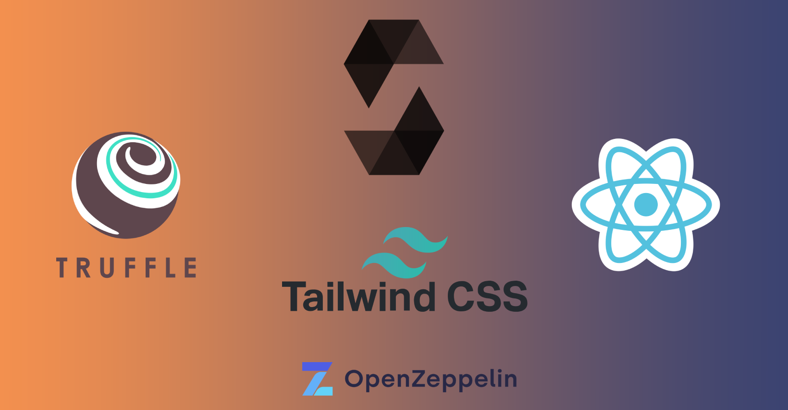
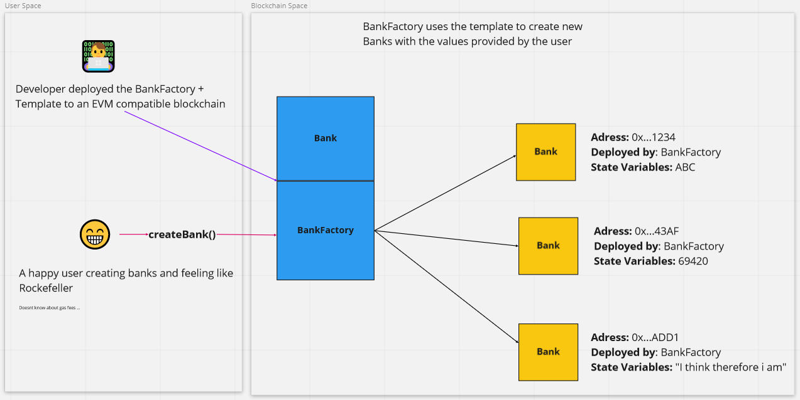

# Debs


- [Debs Website](https://debs.vercel.app)
  You must install metamask extension for your browser to use the website.
  Currently, the website is based on binance smart chain testnet. you can earn free tbnb from [Binance testnet](https://testnet.binance.org/faucet-smart) to work with debs

Decentralized Box Storage to save files on the cloud. It is a decentralized version of [OneDrive](https://onedrive.live.com) and [Dropbox](https://www.dropbox.com). Its based on Blockchain and [IPFS](https://ipfs.io).



# Is IPFS a blockchain?

IPFS is actually a network protocol that aims to replace the currently used protocol, HTTP. It’s based on content-based addressing rather than location-based addressing, which is leveraged by HTTP. IPFS is a decentralized network thought, as a result, many people confuse it with a blockchain.

To give a high-level idea, this URL: https://www.github.com/Is-IPFS-a-blockchain has a particular location on the quora server, i.e., the route “/Is-IPFS-a-blockchain”. There are some systemic problems with this approach. HTTP links can get broken since the content can be moved to some other location or even websites can go down forever. In content-based addressing, we take some data, generate a hash of that data, and that hash will represent the data forever (and it can’t be changed). There is a gotcha here: the sharing of these websites will be “peer-to-peer”, and not controlled by a single entity. Every user can run their own IPFS node on their machine and would be able to access data (or some website) using the hash (called CID - content identifier).

# Smart contracts architecture

In blockchain development, mining sets of data into a blockchain is quite an expensive process because fees are charged for each new data mined into the next block. Deploying smart contracts on blockchain results in mining the contract’s data into the next block, which will cost some gas fees that are charged in Ether if deployed on the Ethereum blockchain.

**The factory pattern**
The factory design pattern is a well-known programming pattern. The concept is simple: instead of directly creating instances of objects, you have a single object (the factory) that does it for you.

This is the same with Solidity because smart contracts are objects. In Solidity, a factory is a contract that will deploy multiple instances of other contracts.

We sometimes need to create different types of objects, but we don’t know what kind of object we’ll instantiate until the code is executed at runtime. In such cases, the factory technique comes in handy.

Generally, a basic factory contract should be able to deploy multiple instances of the same contract, store these created instances on the blockchain, and retrieve them when needed. You may want to add more functionality for managing deployed contracts like retrieving a specific instance of the contract, disabling an instance of the contract, and so on.



# Getting started

- Clone the repository

```
git clone --depth=1 https://github.com/SamanNsr/express-api-boilerplate.git <project_name>
```

- Install dependencies

```
cd <project_name>
npm install
```

- Build and run the project

```
npm run start
```

Finally, navigate to `http://localhost:3000/` and you should see the app running!

## Available Scripts

In the project directory, you can run:

### `npm start`

Runs the app in the development mode.\
Open [http://localhost:3000](http://localhost:3000) to view it in your browser.

The page will reload when you make changes.\
You may also see any lint errors in the console.

### `npm test`

Launches the test runner in the interactive watch mode.\
See the section about [running tests](https://facebook.github.io/create-react-app/docs/running-tests) for more information.

### `npm run build`

Builds the app for production to the `build` folder.\
It correctly bundles React in production mode and optimizes the build for the best performance.

The build is minified and the filenames include the hashes.\
Your app is ready to be deployed!

See the section about [deployment](https://facebook.github.io/create-react-app/docs/deployment) for more information.

### `npm run eject`

**Note: this is a one-way operation. Once you `eject`, you can't go back!**

If you aren't satisfied with the build tool and configuration choices, you can `eject` at any time. This command will remove the single build dependency from your project.

Instead, it will copy all the configuration files and the transitive dependencies (webpack, Babel, ESLint, etc) right into your project so you have full control over them. All of the commands except `eject` will still work, but they will point to the copied scripts so you can tweak them. At this point you're on your own.

You don't have to ever use `eject`. The curated feature set is suitable for small and middle deployments, and you shouldn't feel obligated to use this feature. However we understand that this tool wouldn't be useful if you couldn't customize it when you are ready for it.

## Contributing

If you have any questions or comments, please open an issue or create a pull request.

## License

The MIT License (MIT)

This project was bootstrapped with [Create React App](https://github.com/facebook/create-react-app).
